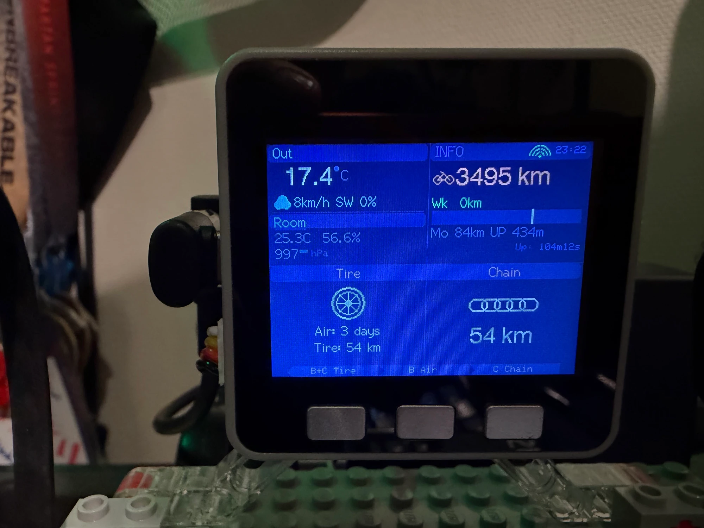

# RideReady M5

[](https://github.com/yoshiori/rideready-m5/actions/workflows/ci.yml)

A bicycle maintenance dashboard firmware for **M5Stack Core ESP32** that displays environmental data, riding stats, weather forecasts, and maintenance reminders on a 320x240 LCD.

## Features

- **Environment monitoring** — Indoor/outdoor temperature, humidity, and barometric pressure via ENV III sensor (SHT30 + QMP6988) with pressure trend indicator
- **Weather forecast** — Outdoor temperature, wind speed/direction, weather code, and 3-hour precipitation probability from Open-Meteo API
- **Strava integration** — Total distance, weekly/monthly stats, and per-item distance tracking via OAuth2 token refresh flow
- **Maintenance tracking** — Tire pressure (time-based), tire change and chain lube (distance-based) with color-coded severity (white/yellow/red)
- **Rain ride detection** — Cross-references Strava activities against Open-Meteo archive to force chain lube CRITICAL after wet rides
- **Wi-Fi & NTP** — Auto-connect with non-blocking reconnect, NTP time sync for date display
- **Dracula color theme** — Clean UI with icon-based layout

## Hardware

| Component | Details |
|-----------|---------|
| Board | M5Stack Core ESP32 (original) |
| Sensor | ENV III Unit (SHT30 + QMP6988) on PORT A (I2C) |
| I2C Pins | SDA=21, SCL=22 |

## Screen Layout



## Setup

### Prerequisites

- [PlatformIO](https://platformio.org/) (CLI or IDE)
- [mise](https://mise.jdx.dev/) (optional, for task runner)

### Configuration

Copy the example config files and fill in your values:

```bash
cp src/wifi_config.h.example src/wifi_config.h
cp src/strava_config.h.example src/strava_config.h
cp src/weather_config.h.example src/weather_config.h
```

### Build & Flash

```bash
mise run build          # Build firmware
mise run upload         # Flash to M5Stack via /dev/ttyUSB0
```

Or with PlatformIO directly:

```bash
pio run -e m5stack-core-esp32
pio run -e m5stack-core-esp32 --target upload
```

> Upload may fail with "Wrong boot mode" — press the reset button on M5Stack and retry.

### Run Tests

```bash
mise exec -- pio test -e native
```

## Project Structure

```
src/           Main firmware (excluded from native test build)
lib/           Reusable libraries (auto-linked in native tests)
  MaintenanceTracker/   Time/distance tracking with NVS persistence
  MaintenanceDisplay/   Display formatting and severity thresholds
  PressureTrend/        Barometric pressure trend detection
  RainRideDetector/     Rain ride detection from activity + weather
  StravaClient/         Strava API JSON parsing
  WeatherClient/        Open-Meteo API JSON parsing
test/          Unit tests (PlatformIO Unity)
```

## Button Map

All resets require a **3-second long press** to prevent accidental triggering.

| Button | Action |
|--------|--------|
| A | Disabled (GPIO39 ghost trigger hardware bug) |
| B (hold 3s) | Reset tire pressure timer |
| C (hold 3s) | Reset chain lube (distance + epoch + rain flag) |
| B + C (hold 3s together) | Reset tire change distance |

## License

Private project.
